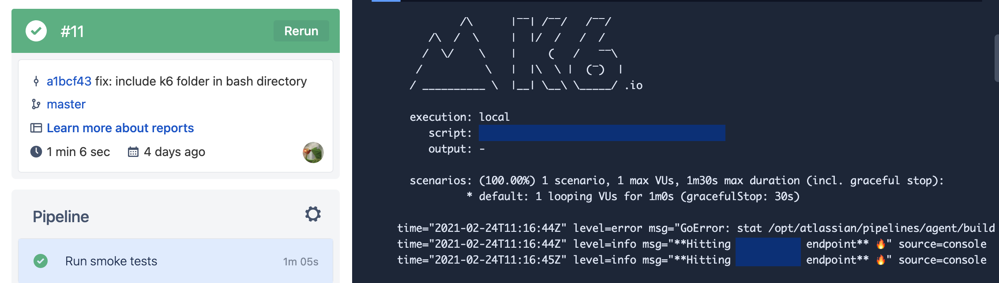

# k6 performance tests - boilerplate / template
k6 integration with Bitbucket pipeline 💪 🧪 🤖

https://k6.io/docs/

## Pre-requisites / Assumptions
* You have installed [k6](https://k6.io/docs/getting-started/installation) on your local machine
* You have installed your favourite IDE which is no other than [VS Code](https://code.visualstudio.com/download)
* Internet is accessible (no proxy!)

## Usage
### Running locally
* Open IDE (VS Code is highly recommended!) then open the forked / cloned repository
* Navigate to Terminal then go to root directory
* Type `k6 run -e HOST=test --address localhost:0 single-request.js` and check results

### Running on Bitbucket Pipeline CI
* Navigate to `Pipelines` then select `Run pipeline`
* From the modal, set the `Branch` and set `Pipeline` to `default` then hit `Run`

Sample:

### TODO
* Include junit report to display no. of tests in CI
